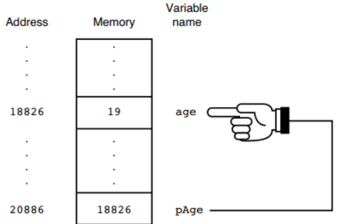

# Pointers

Os *pointers* são considerados como sendo a razão pela qual a linguagem C é tão poderosa. O conteúdo deste livro irá trabalhar com os conceitos basilares de *pointers* a fim de que possamos aprofundá-lo posteriormente.

## Endereços de memória

Quando um programa entra em execução ele e suas respectivas variáveis fica armazenado na **memória principal**. A memória tem diversas localizações para armazenar dados e cada uma dessas localizações tem um **endereço único**. A memória funciona como um grande array com cada endereço de memória funcionando como um diferente índice (subscript) e cada espaço de memória como um elemento diferente deste array.

## Definindo variáveis pointers

Para usar uma variável pointer é preciso defini-la. Vamos aprender sobre dois novos operadores antes de avançar:

Operador | Descrição
-------- | -------------------
`&`      | Address-of operator
`*`      | Dereferencing operator

O **address-of** nós usamos na função `scanf()` porque ela requer que nós determinemos o endereço de variáveis que não são arrays (por isso não a usamos no caso de strings, que são arrays de caracteres).

Para definir variáveis pointers fazemos o seguinte:

```C
int * pNum;
float * pValue;
```

O operador `*` serve apenas para indicar ao compilador que as variáveis acima são *pointers* e não variáveis comuns.

É possível nomeá-los segundo as mesmas regras aplicadas às variáveis normais. No entanto, muitos programadores gostam de colocar a letra p no início para lembrá-los que são variáveis pointers.

Com relação ao tipo de dado, somente é possível usar pointer para referenciar variáveis que tenham o **mesmo** tipo de dado.

**A função principal dessas variáveis é armazenar os endereços de outras variáveis.**

O operador `&` é usado para atribuir o endereço de memória de uma variável para um pointer. Somente a partir deste ponto é que a variável pointer é inicializada.

O código abaixo cria uma variável chamada `age` e logo em seguida o seu endereço de memória é atribuído à variável `pAge`:

```C
int age = 19;
int * pAge = &age;
```

Isso significa que `pAge` *aponta* ou *points to* `age`.



## Usando o *Dereferencing* `*`

*Dereferencing* significa apenas usar a variável *pointer* para pegar a outra variável.

Existem duas maneiras de mudar o valor de uma variável:

`age = 25;` ou `*pAge = 25;`

A segunda maneira ordena à linguagem C que armazene o valor 25 no endereço de memória atualmente armazenado em `pAge`. Como este pointer faz referência ao endereço de memória da variável `age` então, na prática, é o valor desta última variável que é alterado.

Para imprimir os valores de `age` poderíamos usar as duas formas:

`printf("The age is %d\n", age);` ou `printf("The age is %d\n", *pAge);`

O *dereferencing* é usado quando uma função precisa realizar operações em uma *pointer* recebida de outra função. Sua grande utilidade será melhor vista nos capítulos em que forem discutidas as funções.

## Conclusão

Como vimos, uma variável *pointer* é uma variável que armazena o endereço de memória de outra variável.

Aprenderemos nos próximos capítulos que arrays não são nada menos que **pointers disfarçados** e muitos programadores, quando se acostumam com pointers param de usar arrays porque aqueles são mais flexíveis que estes.
