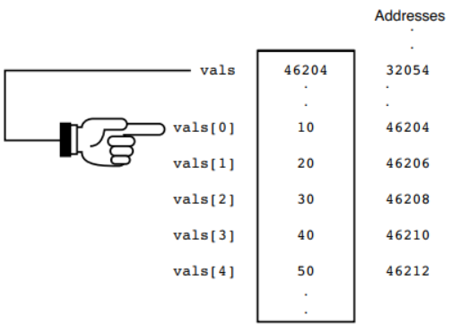

# Arrays e Pointers

Veremos como os arrays e pointers compartilham muitas similaridades. Na verdade, um array é um tipo especial de pointer. Assim, é possível usar a notação dos pointers para pegar valores de um array e vice versa.

## Nomes de Arrays são Pointers

Um nome de array nada mais é do que um pointer para o primeiro elemento naquele array.

`int vals[5] = {10, 20, 30, 40, 50};`

Quando definimos o array acima acontecem duas coisas:

1. São atribuídos índices (subscripts) para cada elemento contido no array.

2. É atribuído um pointer para o array chamado de `vals`.



O nome do array é o pointer do primeiro elemento dele.

Desta forma, poderíamos imprimir o valor do primeiro elemento das duas formas:

`printf("O primeiro valor é: %d", vals[0]);`

ou

`printf("O primeiro valor é: %d", *vals);`

E agora introduzimos uma nova notação que realiza o mesmo:

`printf("O primeiro valor é: %d", *(vals+0));`

## Acessando os outros elementos de um array

Por conta do nome do array ser um pointer para seu primeiro elemento para acessarmos os valores dos índices subsequentes precisamos apenas somar valores  para pegar o valor do índice desejado.

```C
printf("The first array value is %d.\n", *(vals + 0));
printf("The second array value is %d.\n", *(vals + 1));
printf("The third array value is %d.\n", *(vals + 2));
printf("The fourth array value is %d.\n", *(vals + 3));
printf("The fifth array value is %d.\n", *(vals + 4));
```

A operação `(vals + n)` na prática resulta no valor do endereço de memória armazenado no pointer `vals` acrescido do valor em `n`.

Cabe observar, no entanto, que o que realmente ocorre quando fazemos `(vals + 1)`, por exemplo, não é somar o número 1 ao endereço de memória. Na verdade, neste caso, ele adiciona 1 `int size` (o tipo depende do tipo declarado para o array). Então, na prática, equivale a dizer que nós queremos **o segundo integer neste array**.

## Caracteres e Pointers

Vejamos essas duas declarações:

```C
char name[] = "Andrew B. Mayfair"; /* name points to A */
char * pName = "Andrew B. Mayfair"; /* pName points to A */
```

A diferença entre elas é que `pName` é uma variável pointer ao passo que `name` é uma **constante** pointer.

Como `pName` é uma variável, é possível de colocá-la no lado esquerdo de uma equação com o sinal de igual. Assim, nem sempre será necessário usar a função `strcpy()` para atribuir uma nova *string* a um char pointer.

É verdade que o char pointer vai apontar apenas para o primeiro caracter da string. Porém, o `%s` e todas as funções de string irão funcionar com ela da mesma forma que funcionam para arrays de caracteres porque estas funções terminam sua execução no *null zero* (\0);

Portanto, se quisermos mudar a string armazenada em `pName` podemos fazer assim:

```C
pName = "Theodore M. Brooks";
```

Na prática, não estamos realmente colocando "Theodore M. Brooks" em `pName`, até porque ela é uma pointer e só armazena endereços de memória. O que ocorre é que a linguagem C atribui um endereço de memória a essa string e coloca esse mesmo endereço em `pName`.

Aprendemos a atribuir novos valores de strings a variáveis sem precisar de `strcpy()`. Mas tem um detalhe importante a notarmos.

## Cuidado com os tamanhos

Não podemos deixar o programa armazenar strings maiores do que a primeira string que foi apontada com o char pointer. Isto ficará mais claro no exemplo abaixo:

```C
char * name = "Tom Roberts";
/* Resto do programa */
// Tentar pegar uma nova string do usuário
gets(name);
```

O problema do código acima reside na possibilidade de o usuário digitar uma string maior do que "Tom Roberts". Qual o problema que isso gera?

Como as funções `gets()`, `scanf()`, `strcpy()` e `strcat()` não sabem de antemão se estão recebendo char pointers ou arrays de caracteres (que não podem mudar a localização do endereço de memória), elas colocam a nova string no mesmo endereço de memória da variável `name`. E se a nova string for maior do que a primeira, outras posições de endereço de memória que já estavam sendo usadas podem ser sobrescritas.

No entanto, há uma saída que permite ter a flexibilidade de mudança de valor trazida por um char pointer com a mesma segurança de armazenamento e posicionamento de endereço de memória de um array para poder usar char points para obter entradas de usuários.

Primeiro, é preciso **reservar espaço suficiente para as strings esperadas**.

```C
char input[81]; // Armazena uma string de 80 caracteres + \0
char * iptr = &input; // Atribui o endereço de memória de input a char pointer iptr
char * iptr = &input[0]; // Faz a mesma coisa do que a linha anterior
```

Para garantir que o usuário não digite nenhuma string acima de determinada quantidade de caracteres, podemos usar `fgets()` que funciona como `gets()` mas tem como um dos argumentos a quantidade de caracteres limite:

`fgets(iptr, 81, stdin);`

Se o usuário digitar uma string maior, o que ultrapassar o 81º caracter será ignorado.

O argumento `stdin` indica a origem dos dados. *stdin* faz com que seja registrado o que for digitado pelo teclado. Mas também seria possível ler dados de *disk file pointers*, algo que veremos mais adiante.

## Arrays de Pointers

É possível criar um array de pointers da seguinte forma:

```C
int * ipara[25]; // 25 pointers to integers
char * ipara[25]; // 25 pointers to characters
```

O array de caracteres é mais interessante porque ele permite termos uma lista de strings! Mais precisamente, é possível apontar para diversas strings. Esse [exemplo](./sample1.c) mostra como inicializar um array de strings e como imprimi-los usando um loop for.

No exemplo vemos na prática como, apesar da linguagem C ter a limitação de não possuir array de strings, porque não existe o tipo primitivo string, o armazenamento de character pointers (um array que armazena pointers que apontam para o endereço de memória de strings) faz com que na prática tenhamos um array de strings.
