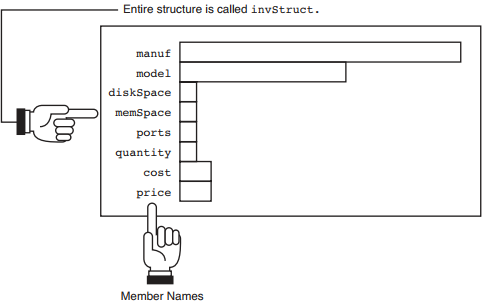

# Organizando os dados com *structures*

Vimos que arrays e pointers funcionam bem para listas de valores com o mesmo tipo de dado. Mas existem situações em que diferentes tipos de dados devem ser enviado e tratados de forma conjunta como por exemplo um registro de cliente.

Cada cliente tem um nome (array de caracteres), saldo (double floating-point), endereço (array de caracteres), cidade (array de caracteres), estado (array de caracteres), CEP (array de caracteres ou de longs).

Apesar de ser importante inicializar e imprimir itens individuais também é importante acessar todas essas informações de uma vez.

A **C structure** é a maneira pela qual podemos agrupar esses dados e obtê-los também de forma individualizada, chamados **members**. Para várias ocorrências desse dado e para muitos clientes será preciso usar um **array de structures**.

## Definindo um *structure*

O primeiro passo é informar como será a estrutura que estamos definindo.

Uma *structure* é apenas um grupo de data types individuais. Ela possui um nome e pode ser considerada como um único valor (cliente). Seus componentes individuais são os tipos de dados primitivos da linguagem como *int*  e *char*, por exemplo.

Uma forma de pensar em uma *structure* pode ser vê-la como um formulário cheio de campos que devem ser preenchidos. Após defini-la, somente após atribuir uma variável para ela é que é reservado o espaço de memória necessário.

Uma definição de *struct* segue esse padrão:

```Plain Text
struct [structure tag] 
{
  member definition;
  member definition;
  ...
  member definition;
}
```

A *keyword* `struct` define apenas o *layout* da *structure. A `structure tag` é o nome da estrutura.

As `member definition` são as definições de tipos de dados que fazemos como `int age`, por exemplo. Mas neste caso, não estamos definindo variáveis e sim **members**, dando um nome a essa parte específica da estrutura.

Vamos a um exemplo mais palpável:

Precisamos escrever um programa que armazene informações sobre um computador como: fabricante, modelo, espaço de armazenamento (em MB), espaço de memória RAM (em MB), quantidade, custo e preço de venda.

Abaixo temos um possível exemplo de *struct*:

```C
struct invStruct {
  char manuf[25]; // Manufacturer name
  char model[15]; // Model code
  int diskSpace; // Disk size
  int memSpace; // RAM size
  int ports; // Number of USB ports
  int quantity; // Number in inventory
  float cost; // Cost of computer
  float price; // Retail price of computer
};
```

Veja um diagrama que representa a *struct* que acabamos de criar:



É importante notar que nós não definimos 8 variáveis. `invStruct` representa a estrutura de um tipo de dados que nós criamos. Após definir como é a estrutura é que podemos definir variáveis que sigam essa estrutura.

Quando criamos *structs* que precisaremos reutilizar é importante considerar colocá-lo no seu próprio *header file* ou em um *header file* com outras *structs* comuns ao seu programa.

Normalmente, os programadores colocam essas declarações de *struct* antes da função `main` e definem variáveis para esse tipo de dado dentro de `main` e em qualquer outra função após `main()`.

Para declarar uma variável com esse data type basta fazer:

```C
#include <struct.h>

int main(){
  struct invStruct item1;
}
```

Se quiséssemos um array com 500 variáveis desse tipo:

```C
struct invStruct item[500];
```

Também podemos criar pointers para as *structs*:

`struct invStruct *item1, *item2, *item3;`

E também podemos reservar heap memory para essas estruturas em vez de usar variáveis:

```C
item1 = (struct invStruct *) malloc(sizeof(invStruct));
```

Essa declaração reserva espaço para armazenar 1 entrada desse tipo de dados e faz a pointer item1 apontar para seu endereço de memória.

## Colocando dados em variáveis *struct*

O operador `.` é o que permite colocar dados em uma variável struct. Veja o formato:

`structureVariableName.memberName`

Esse operador permite colocar dados apenas em variáveis structs declaradas. Se quisermos colocar dados na heap memory que está sendo apontada por uma struct pointer é preciso usar o operador `->`

O [1º exemplo](./sample1.c) que veremos tem um programa que define um array de três variáveis struct usando a estrutura `bookInfo` declarada no header file `bookInfo.h`. O usuário será requisitado a preencher as variáveis e o programa irá imprimi-los.

O [2º exemplo](./sample2.c) é similar ao primeiro, mas nos mostra como usar o operador `->` no caso de desejarmos armazenar os valores na heap memory em vez de em uma variável.
