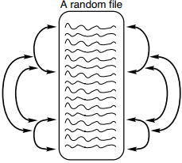

# Salvando Random Files no Computador

O capítulo se dedica a mostrar como percorrer um arquivo, **lendo e escrevendo** os dados à medida em que avançamos.

Uma importante limitação dos métodos apresentados no capítulo anterior é o fato de não ser possível fazer alterações pontuais em determinadas linhas. Para isto, seria necessário reescrever todo o arquivo juntamente com as modificações e torná-lo um novo arquivo.

Com os métodos aqui apresentados é possível, por exemplo, encontrar dados específicos do saldo de um cliente, armazená-los em uma variável, modificá-lo, e reescrevê-lo exatamente na posição anterior.

A imagem abaixo ilustra como o acesso aleatório faz esse processo:



Com isto, podemos acessar qualquer posição de qualquer tipo de arquivo. É importante lembrar que qualquer arquivo é simplesmente uma sequência contínua de bytes, por isso, mesmo que um arquivo tenha sido criado de forma sequencial ele pode ser acesso e modificado de forma aleatória.

## Abrindo Random Files

A função para abrir random files é a mesma dos sequential files: `fopen()`. O que vai mudar é a string mode:

Mode   | Descrição
------ | ---------------------------------------------------------------------------------------------------------
`"r+"` | Abre um arquivo existente para **ler** e **escrever**
`"w+"` | Abre um novo arquivo para **escrever** e **ler**
`"a+"` | Abre um arquivo no modo de reescrita (começa na última linha, mas permite ir a qualquer ponto do arquivo e **ler** e **escrever**)

Como podemos ver, todos os três modos permitem ler e escrever. A escolha dentre os três vai depender do que queremos fazer **primeiro** no arquivo.

```C
fptr = fopen("C:\\User\\DeanWork\\letters.txt", "w+");
```

Uma dica sobre o endereço dos arquivos é a possibilidade de armazená-los em um character array e colocar a indicação da posição do array como argumento do filename em `fopen()`.

Também é preciso fechá-lo usando `fclose()`.

## Se movimentando em um arquivo

Usamos `fseek()` para percorrer um arquivo random-access aberto. Quando um arquivo é aberto, normalmente o file pointer aponta para o próximo local do arquivo em que é possível ler ou escrever.

Com `fseek()` é possível apontar para outras posições, usando a seguinte sintaxe:

`fseek(filePtr, longVal, origin);`

- `filePtr` é o mesmo file pointer do arquivo que foi aberto.

- `longVal` é uma variável *long int* que pode ser negativa ou positiva, indicando o número de bytes que devem ser retrocedidos ou avançados.

- `origin` é o ponto de partida da leitura/escrita. Pode assumir os seguintes valores da biblioeca `<stdio.h>`:

Origem     | Descrição
---------- | -----------------
`SEEK_SET` | Começo do arquivo
`SEEK_CUR` | Atual posição no arquivo
`SEEK_END` | Fim do arquivo

Ao colocar o pointer e escrever em posições previamente preenchidas por dados, eles acabam sendo sobrescritos.

Vejamos um [exemplo](./sample1.c) mostrando como abrir um arquivo em random-access mode, escrevendo as letras de A a Z e depois lendo-as e imprimindo-as na tela de trás para frente.

A função que usamos `fputc()` é ótima para imprimir caracteres individuais em um arquivo. `fgetc()` lê caracteres individuais em um arquivo.

Como podemos ver, o random access tem a vantagem de escrever os dados e lê-los sem precisa abrir e fechar o arquivo. E `fseek()` permite posicionar o file pointer em qualquer número de bytes a partir do início, meio e fim do arquivo.

O segundo exemplo pergunta ao usuário qual a posição do arquivo que foi gerado no primeiro que ele deseja modificar. O programa usará `fseek()` para posicionar o file pointer na posição indicada e escreve um `*` naquele ponto. Depois ele retorna à posição inicial do arquivo e o reimprime do início ao fim.
